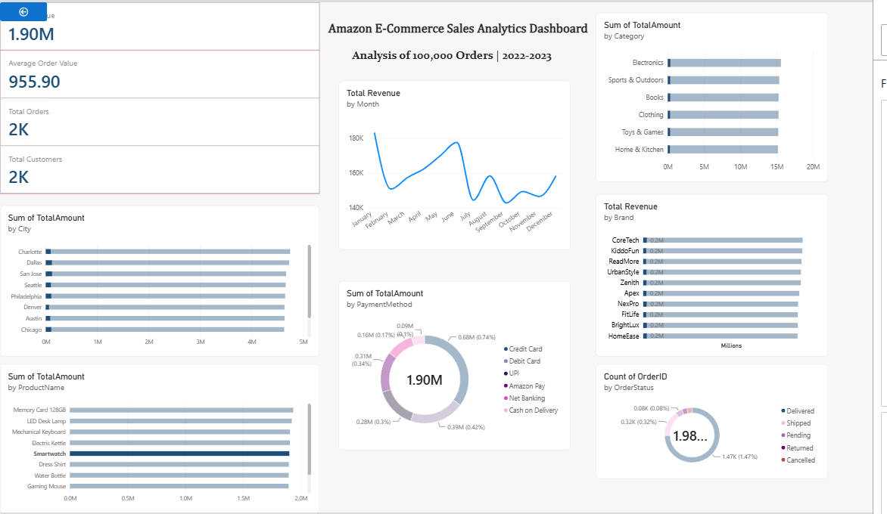

# Amazon E-Commerce Sales Analytics

## Project Overview
This project analyzes 100,000 Amazon e-commerce orders to uncover sales trends, customer behavior, product performance, and operational insights.

## Dataset Information
- Records: 100,000
- Columns: 20

## Technologies Used
- Python
- Pandas
- SQL
- Power BI
- Git & GitHub

## Business Objectives
- Analyze sales performance
- Identify top-selling categories
- Evaluate customer purchasing trends
- Study payment methods
- Monitor order status performance
- Generate actionable business insights
## Key Insights

- Electronics generated the highest revenue ($15.58M).
- Memory Card 128GB was the highest revenue product.
- Charlotte generated the highest city-level revenue.
- CoreTech was the best-performing brand.
- Credit Card was the preferred payment method.
# Amazon Sales Analytics Dashboard

## Tools Used
- Python
- Pandas
- NumPy
- Matplotlib
- Power BI

## Project Workflow
1. Data Cleaning
2. Exploratory Data Analysis
3. Business Analysis
4. Dashboard Development

## Key Insights
- Total Revenue: 91.83M
- Total Orders: 100K
- Top Category: Electronics
- Top Brand: CoreTech
- Top City: Charlotte
- Most Used Payment Method: Credit Card

